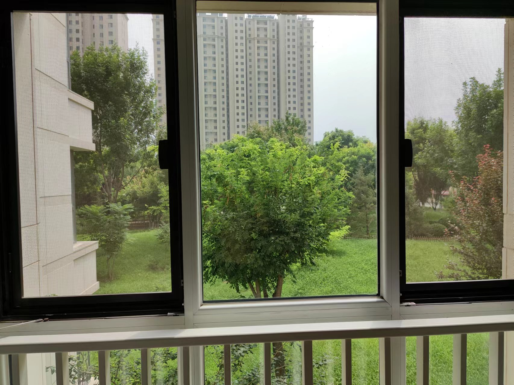

# Thinking-on-general-AI
通往通用人工智能的思考（天马行空的手稿）

# 为什么有此文
最近看了一些论文，看到很多科学家在一些数据集上使用各种trick，
试图提升算法在该数据集上的表现，感觉有点疲倦了。
诚然，现在的机器学习模型已经帮我们有效地解决了很多问题。
但是，大部分的功效还是处于提升效率的层面，而在精度层面，
还有很长的路要走。就比如说，CV圈非常火的COCO数据集，
当前（2022年8月13日）最好的模型也就是60多的mAP，这个距离
人类的识别水平还有很大距离。不过在ImageNet上的分类效果，似乎
已经超越了人的水平，但是，图像分类实在是一个过于简单的任务了。
如果现在的模型的目标检测的效果能像图像分类一样超越人类的水平，
那这对于提升社会生产力将会有巨大的提升，甚至可以说是一次新的
工业革命。

但是，我觉得很难。我的理由是现在的模型太过于依赖统计，当然，
不是说统计不好，我们在做一件事情的时候，也会梳理以往的经验，
其实也是统计。但是，我们在统计的同时，还会加上当前时刻的特殊性，
因为世界上没有两片一样的叶子，没有哪个场景是完全和之前的场景
一致。人脑在决策时候，不仅会考虑到以往的经验，还会关注到当前场景
的特殊性，再从脑海中调取该特殊性背后潜在可能推理出来的信息，最终
才能做出决策。

虽然很多科学家在统计学习的路上马不停蹄的耕耘，但是，一直给我一种
一眼能看到头的感觉，尤其是在我前两年读了朱松纯的几篇文章之后。
也更加认识到如果不能训练一个具备通用智慧的AI模型，仅在像COCO
数据集上卷，对未来的AI的发展贡献不会太大。

当然，这里我也要自我批评一下，我自己在AI界就是一个无名小卒，如此
大言不惭地对这么大的话题指手画脚多少是有一点班门弄斧了，大家
就全当做是童言无忌吧。

我就是想到哪写到哪，偶尔也会调整一下章节的顺序，就天马行空的想，
就跟进行一次长途旅行一样，走走停停，笔法上我也就没那么注意了，
随性一点。

# 通用智能 之于我
小时候喜欢看《终结者》，尤其痴迷于机器人的第一视角，可以看到很多
酷炫的参数在闪烁，让我激动不已，经常拉着小伙伴来我家里看，当然，
还有《机器人之恋》我也很喜欢。这里面的机器人就是一种具有通用智慧
的机器人，比如七弟会打拳，开车，打枪，帮助女主作弊，以及最后黑化
爱上女主。

好像是2015年的时候，我那时候大学三年级，是一个风和日丽的下午，
我正要去上一节电子商务的课程，然后就打不起精神，因为昨天刚写了
很多代码，当时在琢磨着开发一个C++的游戏，写得我头晕脑胀的。然后，
看了一会alphaGo和李世石的比赛，我当时的感觉就是这玩意有点意思，
不过结果应该是没有悬念的，肯定是计算机会赢了，不然他们拉出来比赛
输了那不闹呢吗。有意思的是当时有一个美女主持人问叨叨魏，谁会赢，
叨叨魏笑着说，肯定是AlphaGo了。然后美女又问，你说他这么厉害，
会不会成为取代人类的生物。然后叨叨魏就反问她，你先说一下生物的定义。
然后，反正又是噼里啪啦说了一顿，我印象比较深的就是，有人问道
AlphaGo和人类的思考方式的时候，叨叨魏说了句，它不具有像人类一样的
通用智慧。

最近一次通用智慧对我触动比较大是在我前领导去了BIGAI之后的一次聚餐上，
饭桌上聊到了朱松纯的一些想法，后来我自己也看了他的一些采访记录，比如
[《浅谈人工智能：现状、任务、构架与统一 | 正本清源》](https://mp.weixin.qq.com/s/-wSYLu-XvOrsST8_KEUa-Q)
。突然感觉这可能是一种不错的做法，尤其是里面有一句 “Go Dark， Beyond Deep”
大概意思就是说，一张图片里面蕴含的信息是非常少的，有很多像宇宙中的暗物质
一样的东西在图像中是看不到的，其实就是用暗物质比喻人的常识了。其实，
这也很好理解，假设我们看一张图片，一个远处的人，拿着一个不知道什么的东西
放在耳边，嬉笑的说话，常识就会告诉我们他手里应该拿的是手机，他可能正在
打电话。我就思考，如果能把这些common sense建模起来是不是就牛皮了。

最近公司正在做一个项目，需要识别网考学生是否在作弊，要识别的物体有使用
多人、看手机、看屏幕、带耳机、看笔记本、看笔记纸之类的。这个项目乍一看挺简单是吧？不就是个
目标检测吗。等我做了一段时间就发现不是那么回事，首先是没有标注数据，
给我的数据都是一整场考试下来的30多w的抓拍照，像我这么懒的人是不可能
去标注数据的，而且这个工作量也不能接受。只能是找找公开数据集，然后就找
到了旷视的objects365，这里面还算不错，基本类别都有，只是没有笔记纸，
得，那就不识别笔记纸了呗~ 先别急，这里面还有很多别的问题了，我们再说
笔记本，objects365里面有一个book类，应该是和笔记本最像的了，但是
很多人家里的背景就是一个书柜，里面自然就有很多书，得，笔记本这一类也
有毛病。您还是先别急，再看多人，很多考生的海报里的人，哪怕是一个布娃娃
在objects365上都是会标记为人的，我哭了，人也凉了。我刚擦完眼泪，再看
耳机，objects365中的耳机有头戴式和入耳式，头戴式的还算简单，但是入耳式
就难搞了啊，有的人比较胖，脸都把耳机挡住了，但是我们能清楚的看到两根耳机线
但就是无能为力，因为objects365标注入耳式耳机的时候，只标注了耳机的位置，
不算耳机线的，得，耳机也凉了一半。我刚冠上一个暖水袋准备捂一捂拔凉的内心的时候，
突然想到，什么叫TM的“看手机”、“看屏幕”啊？这意思是检测到手机还不行，还得是
有看的动作。我吐了，这个项目可以说是我职业生涯里对我非常大的打击。
我突然就想到了《香水》里的男主，当得知不能提取味道之后大病一场的场景了。

至此，我认识到 通用AI能力的重要性。没有它的话，未来我一定会很难受的。
因为我这个人稍微有点强迫症，感觉这个工程被自己做成了一个粑粑活。所以我就
准备思考如何赋予机器通用的智能。

2022年8月13日13:16:20于阳台拍摄

待续...

# 新生儿的认识和知道
我们知道，新生儿从离开母亲来到世界的那一刻，是什么都不认识的，什么也不知道
的。不知道妈妈是什么，不知道小推车是什么，甚至不知道自己是什么。
其实，这里有两个关键词，一个是“认识”，一个是“知道”。“认识”主要是强调对
某个物体的固有属性的了解，比如说，站在我面前的是一个人。人可以有头、脖子
等身体部位组成，人有自己的身高、体重等。如果达到了认识的水平，那婴儿就可以
区分产房里哪个是人，哪个是小推车等之类的物品。而“知道”就要比“认识”高
一个层次，“知道”主要强调在认识的基础上，还知道某物体具备哪些功能或
情绪之类的东西。以区分妈妈和护士来说，不仅要认识屋里有两个人，还要知道
哪个人是妈妈，哪个人是护士，只有区分开，未来婴儿才会知道谁能给自己喂母乳。

当然，这里用的 认识 和 知道 其实在汉语语境下很多时候都可以混用。所以，
我还是在精简一下我想表达的意思，“认识”侧重强调定位并识别出抽象物体；
而“知道”侧重强调对识别出的抽象物体进行差异化识别，然后脑海里可以赋予该
物体具备的独特特性。

其实对应当前CV的技术就是人物检测+人脸识别。等于是把两个紧密结合的任务
完全的分开做了。

那么，新生儿是先学会认识的，还是先学会知道的呢？用力思考一下自己当时是
如何做的，不过应该是记不起来的了，我也不相信世界上有人会记得自己
刚出生时候做的那些事情，其实这一点也挺有趣的。不禁就要问，为什么人从
出生到死亡一直在接受和处理外界的信息，为什么长大一点接受和处理过的信息
就都保存在脑海中了，而更小时候的信息就都丢失了呢？那么我们有记忆的
时间节点又是什么时候呢？

我用力回想我的童年最早的还有记忆的事情是，我5岁的时候，那个场景是我去
小伙伴家里玩，然后打闹追逐，跨过她家门槛的时候我大喊了一句，我5岁，
然后她大喊了一句，我4岁。那可以说这个时间节点是5岁的时候吗？显然
不对。因为，在我5岁的时候，都能跑能跳了，每天也知道去找谁一起玩了，
说明当时是肯定有记忆的了，已经能很好的处理外界的信息了。只不过，
20几年过去了，更多的记忆已经丢失了。这一点也挺奇妙的，人脑不像计算机，
计算机记录之后的数据就不会丢失了，而人脑记录之后的数据是会丢失的。
其实，人脑丢失的哪些数据都是一些稀疏平常的记忆。还是以我为例，我可能
除了跨门槛喊5岁的场景还记着，之前的记忆可能就被大脑抽象存储了，可能
就存储了一点点最有价值的信息，比如，这个小伙伴人挺好的，没和我打过架，
以后还能找她玩之类的。其实换个角度来说，假设某人的记忆不会丢失，那么，
他的脑袋存储的东西就会越来越多，就像一台摄像机一样，把一天天发生的事情
都录成视频，我们不禁就会问，他的脑袋存的下这么多东西吗？接着就会问，
即便存的下，当他回忆往事的时候，会不会检索速度极其的慢，导致他大脑冒烟？
如果检索速度降下来了，那他的即时反应能力也会大大降低，比如当一辆车失控，
向他撞过来的时候，他还要去思考好久，那小命都没了。

所以，我们也常说，一个人如果心里装的事情越多，那么他就很难集中精力做一些
事情，活的也很累。这么想下来，是不是我们还要感谢大脑的遗忘机制，这是对
我们身体的保护。当然，这里的遗忘肯定不是从记忆中完全的删除，而是以一种
更加“廉价”的存储方式保存了下来，比如，总结出了一个经验，或者总结出某个人
人品很差，要远离他等等。

