# Thinking-on-general-AI
通往通用人工智能的思考（天马行空的手稿）

# 为什么有此文
最近看了一些论文，看到很多科学家在一些数据集上使用各种trick，
试图提升算法在该数据集上的表现，感觉有点疲倦了。
诚然，现在的机器学习模型已经帮我们有效地解决了很多问题。
但是，大部分的功效还是处于提升效率的层面，而在精度层面，
还有很长的路要走。就比如说，CV圈非常火的COCO数据集，
当前（2022年8月13日）最好的模型也就是60多的mAP，这个距离
人类的识别水平还有很大距离。不过在ImageNet上的分类效果，似乎
已经超越了人的水平，但是，图像分类实在是一个过于简单的任务了。
如果现在的模型的目标检测的效果能像图像分类一样超越人类的水平，
那这对于提升社会生产力将会有巨大的提升，甚至可以说是一次新的
工业革命。

但是，我觉得很难。我的理由是现在的模型太过于依赖统计，当然，
不是说统计不好，我们在做一件事情的时候，也会梳理以往的经验，
其实也是统计。但是，我们在统计的同时，还会加上当前时刻的特殊性，
因为世界上没有两片一样的叶子，没有哪个场景是完全和之前的场景
一致。人脑在决策时候，不仅会考虑到以往的经验，还会关注到当前场景
的特殊性，再从脑海中调取该特殊性背后潜在可能推理出来的信息，最终
才能做出决策。

虽然很多科学家在统计学习的路上马不停蹄的耕耘，但是，一直给我一种
一眼能看到头的感觉，尤其是在我前两年读了朱松纯的几篇文章之后。
也更加认识到如果不能训练一个具备通用智慧的AI模型，仅在像COCO
数据集上卷，对未来的AI的发展贡献不会太大。

当然，这里我也要自我批评一下，我自己在AI界就是一个无名小卒，如此
大言不惭地对这么大的话题指手画脚多少是有一点班门弄斧了，大家
就全当做是童言无忌吧。

我就是想到哪写到哪，偶尔也会调整一下章节的顺序，就天马行空的想，
就跟进行一次长途旅行一样，走走停停，笔法上我也就没那么注意了，
随性一点。

# 通用智能 之于我
小时候喜欢看《终结者》，尤其痴迷于机器人的第一视角，可以看到很多
酷炫的参数在闪烁，让我激动不已，经常拉着小伙伴来我家里看，当然，
还有《机器人之恋》我也很喜欢。这里面的机器人就是一种具有通用智慧
的机器人，比如七弟会打拳，开车，打枪，帮助女主作弊，以及最后黑化
爱上女主。

好像是2015年的时候，我那时候大学三年级，是一个风和日丽的下午，
我正要去上一节电子商务的课程，然后就打不起精神，因为昨天刚写了
很多代码，当时在琢磨着开发一个C++的游戏，写得我头晕脑胀的。然后，
看了一会alphaGo和李世石的比赛，我当时的感觉就是这玩意有点意思，
不过结果应该是没有悬念的，肯定是计算机会赢了，不然他们拉出来比赛
输了那不闹呢吗。有意思的是当时有一个美女主持人问叨叨魏，谁会赢，
叨叨魏笑着说，肯定是AlphaGo了。然后美女又问，你说他这么厉害，
会不会成为取代人类的生物。然后叨叨魏就反问她，你先说一下生物的定义。
然后，反正又是噼里啪啦说了一顿，我印象比较深的就是，有人问道
AlphaGo和人类的思考方式的时候，叨叨魏说了句，它不具有像人类一样的
通用智慧。

最近一次通用智慧对我触动比较大是在我前领导去了BIGAI之后的一次聚餐上，
饭桌上聊到了朱松纯的一些想法，后来我自己也看了他的一些采访记录，比如
[《浅谈人工智能：现状、任务、构架与统一 | 正本清源》](https://mp.weixin.qq.com/s/-wSYLu-XvOrsST8_KEUa-Q)
。突然感觉这可能是一种不错的做法，尤其是里面有一句 “Go Dark， Beyond Deep”
大概意思就是说，一张图片里面蕴含的信息是非常少的，有很多像宇宙中的暗物质
一样的东西在图像中是看不到的，其实就是用暗物质比喻人的常识了。其实，
这也很好理解，假设我们看一张图片，一个远处的人，拿着一个不知道什么的东西
放在耳边，嬉笑的说话，常识就会告诉我们他手里应该拿的是手机，他可能正在
打电话。我就思考，如果能把这些common sense建模起来是不是就牛皮了。

最近公司正在做一个项目，需要识别网考学生是否在作弊，要识别的物体有使用
多人、看手机、看屏幕、带耳机、看笔记本、看笔记纸之类的。这个项目乍一看挺简单是吧？不就是个
目标检测吗。等我做了一段时间就发现不是那么回事，首先是没有标注数据，
给我的数据都是一整场考试下来的30多w的抓拍照，像我这么懒的人是不可能
去标注数据的，而且这个工作量也不能接受。只能是找找公开数据集，然后就找
到了旷视的objects365，这里面还算不错，基本类别都有，只是没有笔记纸，
得，那就不识别笔记纸了呗~ 先别急，这里面还有很多别的问题了，我们再说
笔记本，objects365里面有一个book类，应该是和笔记本最像的了，但是
很多人家里的背景就是一个书柜，里面自然就有很多书，得，笔记本这一类也
有毛病。您还是先别急，再看多人，很多考生的海报里的人，哪怕是一个布娃娃
在objects365上都是会标记为人的，我哭了，人也凉了。我刚擦完眼泪，再看
耳机，objects365中的耳机有头戴式和入耳式，头戴式的还算简单，但是入耳式
就难搞了啊，有的人比较胖，脸都把耳机挡住了，但是我们能清楚的看到两根耳机线
但就是无能为力，因为objects365标注入耳式耳机的时候，只标注了耳机的位置，
不算耳机线的，得，耳机也凉了一半。我刚冠上一个暖水袋准备捂一捂拔凉的内心的时候，
突然想到，什么叫TM的“看手机”、“看屏幕”啊？这意思是检测到手机还不行，还得是
有看的动作。我吐了，这个项目可以说是我职业生涯里对我非常大的打击。
我突然就想到了《香水》里的男主，当得知不能提取味道之后大病一场的场景了。

至此，我认识到 通用AI能力的重要性。没有它的话，未来我一定会很难受的。
因为我这个人稍微有点强迫症，感觉这个工程被自己做成了一个粑粑活。所以我就
准备思考如何赋予机器通用的智能。

2022年8月13日13:16:20于阳台拍摄

待续...

# 婴儿成长的启示
大自然是非常智慧的，总是以各式各样的方式启示着人类，人类很多的灵感也都
与大自然相关。比如，现在很多仿生学的创造，蝙蝠的超声波、鸟儿的飞行等等。
探究刚出生的婴儿的学习过程对于我们研究如何赋予一个机器以人的智能是非常
有帮助的。在[《婴儿的成长》](https://www.bilibili.com/video/BV1JW411n7sM) 
的纪录片中有很多对婴儿行为的研究，比如：
婴儿的蹒跚学步、认知思考、牙牙学语、感情的萌发、感情的归属、感情的交流
如果我们不断思考如何让机器能够把这些婴儿的行为很好的建立模型，那么可能
为通向通用AI能力提供很多启示，这会帮助我们在未来更全面地考虑如何创造具备通用
智慧的程序。下面我们就梳理一下婴儿的成长过程，看看能给我们带来什么启示。

# 蹒跚学步
## 踏步运动——反射运动
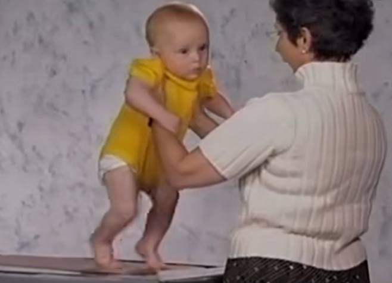
人类婴儿和其他哺乳动物不一样，人类婴儿出生后是不能独立站立的，也不能独立
行走，但是在出生2天后，在外力的协助下，可以做出踏步运动。但是要发展出
控制踏步运动的能力，则需要几个月的时间。这种踏步模式可以说是与生俱来的。
回想动物世界中的刚出生的羚羊宝宝，它出生后经过简单的尝试，马上就可以行走。

## 踢腿
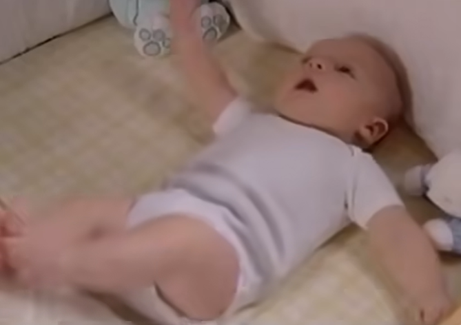
2个月大的婴儿，最会做的事情就是踢腿，踢腿也是踏步模式，只不过是位置不同，
这个活动很重要，宝宝经常踢退可以锻炼腿部肌肉的力量，为以后坐、立、行做好
运动准备，踢腿可以增加身体消耗、促进消化、防止小儿肠胀气的发生。
那么，不禁要问，婴儿怎么知道这些好处，然后踢腿的呢？
邹丽萍医生认为， 导致宝宝喜欢蹬腿玩的原因，一般有两个：
1、由于宝宝太小，神经系统还没有发育健全，出现蹬腿玩的情况属于下肢肌肉
不自主的抽动，也是神经系统自我调节的一种方式。
2、宝宝的原始反射，像竖抱两个月以内的宝宝，当宝宝的脚碰出家长的腿出现踏步
现象一样。

## 控制环境
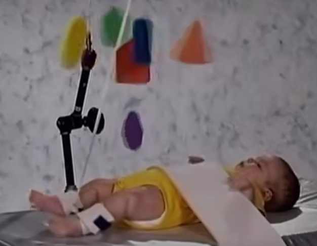
在2个月大的婴儿腿上绑一条绳子，绳子另一端连接着玩具，经过几分钟，婴儿就
发现了蹬腿可以控制玩具，然后就不断的蹬腿来控制他能够掌控的环境，
婴儿和成人一样，喜欢掌控的感觉。

## 尝试翻身
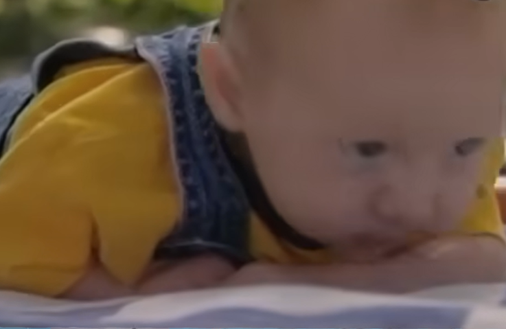
风和日丽的下午，家人们在户外野餐，2个月大的小宝贝还不会翻身，主要是因为
肌肉不够有力，但是他可以挣扎的把头抬高，看到几秒钟的更广阔的风景，然后
就支撑不住了，然后就开始哭闹，等待大人过来帮他翻身，然后他看到了美丽的
天空，树叶，鸟儿等丰富的景物，就不哭了，然后开始自行选择视野，并随意更换
有意识的观看自己感兴趣的景物。
小宝宝知道翻身后有很多好玩的东西可以看，所以小宝宝就非常急切的想学会翻身。

## 翻身
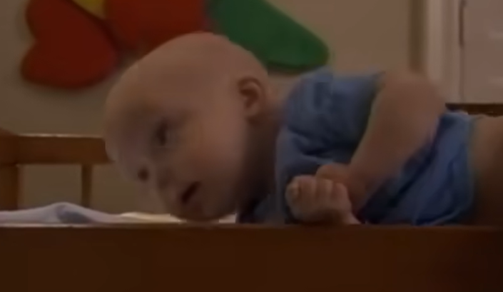
小宝宝经过不断的踢腿、尝试翻身之类的动作后，差不多5个月大的时候，
肌肉就足以让他翻身了，当他学会翻身之后，就可以更加自由的控制自己的视野，
崭新的奇妙世界正在呼唤着他。

## 抓握——反射运动
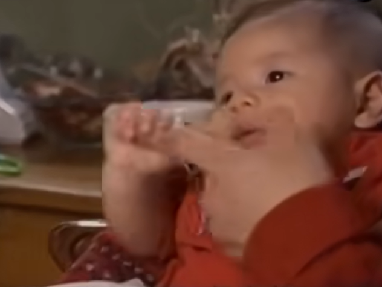
和踏步运动一样，婴儿的抓握反射动作也是与生俱来的。
婴儿的小手可以紧握，但无法放开。
至于伸手拿东西，则需要更好的协调能力。

## 伸手拿东西
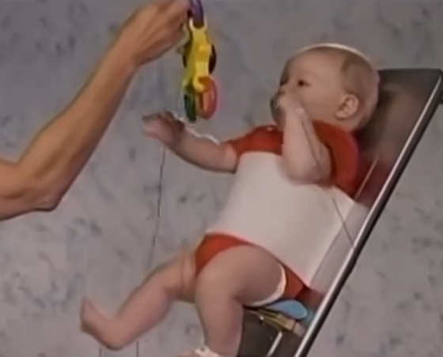
伸手拿东西是婴儿身心发展的重要里程碑。
4个月大的小宝宝，很想拿到玩具，他开始伸手，但无法完成拿东西的动作，
科学家认为，手臂有很多不同的移动方式，而四个月的宝宝尚未掌握伸手拿东西的
肌肉模式。但是双脚却却可以，因为脚的动作范围较小，因此更容易控制。
因此，宝宝在学会用手拿东西之前，是可以用脚去取东西的。

5个月大的宝宝就可以协调手臂动作了，他已经发现了伸手拿东西的肌肉模式了，
他的双手在眼睛的引导下可以拿到所吸引他的玩具，然后拿到眼前，凑近观察。

伸手拿东西代表婴儿对周围世界的认知发生改变，欲望开始产生，他们开始可以
掌握外在的世界。

## 估量空间和距离
婴儿的一些动作看似没有规律，但它正在学习估量空间和距离，这是一个手眼协调
的过程

## 坐起来
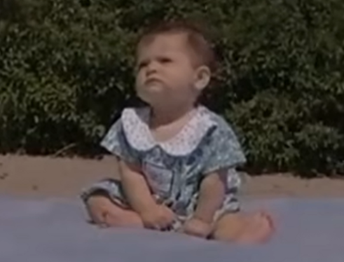
当婴儿7个月大的时候，就能坐起来了，并发现自己可以看得更远，小孩子坐着的时候，
还需要用手进行辅助才能保持平衡，她很高兴可以看到更宽广的世界，这种突破是她首次
察觉自己是独立的个体。

## 坐着保持平衡
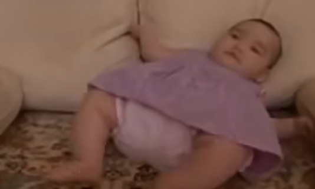
7个月大的婴儿仍然头重脚轻，一旦婴儿坐着能保持平衡的时候，下一个挑战就是
将手伸向任意位置时都能保持平衡。

## 坐着拿东西并保持平衡
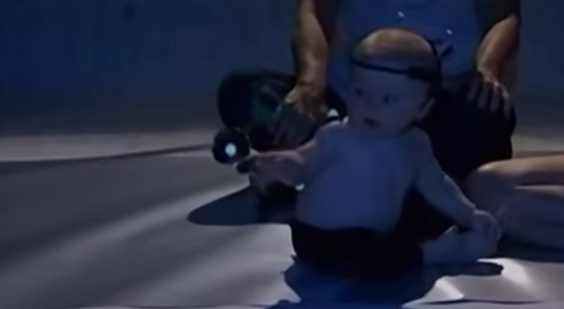
这一动作需要头部、手臂、眼睛、双腿同时协调。
婴儿需要先通过眼睛确定玩具的位置，了解是否在他伸手可触及之处，举起手臂
稳定头部和身躯，但7个月大的婴儿很难整合这些动作，需要多加练习。

世界的神秘促使我们采取行动

## 爬行
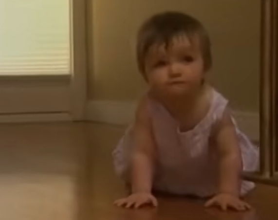
爬行给婴儿带来自由，引发他追求新的目标，并带来极大的快乐，发现他们
从没见过的秘密地点。

## 评估危险
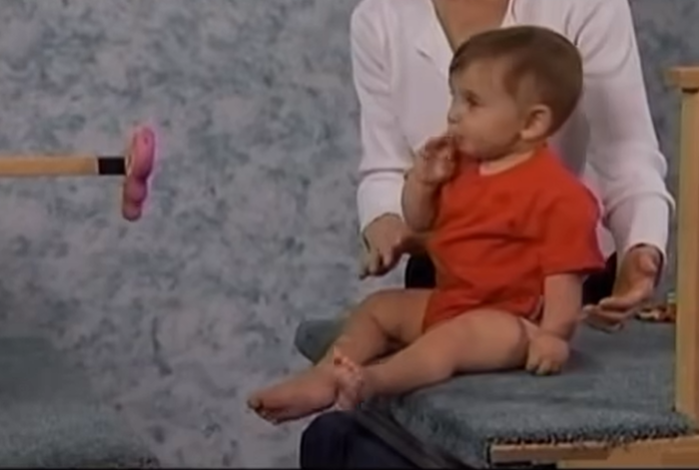
从翻身到坐着，再到爬行，每个新姿势都带来有待学习的新课题，也会
带来新的危险。
9个月大的小宝宝已经掌握了很多坐着的技巧，他已经知道了身体大概
倾斜多少会让身体失去平衡，然后摔倒。所以，当试验台的缺口太大的时候，
他拒绝伸手拿玩具，他在欲望和理智之间挣扎，说明他评估出了危险。

而当让这个刚学会爬行的宝宝爬的时候，他会毫不迟疑的爬向他坐着时
不敢越过的大缺口，那么结果也是毫无疑问的摔得很惨，这也就表明
当婴儿每次学会一个新的姿势后，必须还要
学习该姿势下自己的极限（自己能越过多远/多深的缺口）。
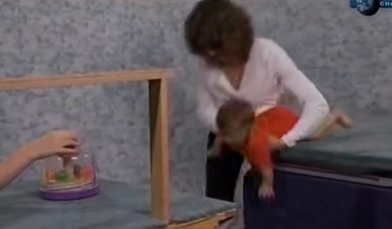

## 坐着和爬行时风险评估的区别
在婴儿学习坐着的时候，肯定会经历坐不稳而摔倒的情况，每次摔倒都会痛，
那么婴儿就会慢慢了解到，当身体倾斜到大概什么角度的时候，就会摔倒，
从而规避摔倒。这个过程和视觉的关系不是很大。

然而，评估爬行时摔倒的风险要比评估坐着时摔倒的风险更困难。
因为爬行时，还需要把环境的高度、深度等信息也考虑进来。

## 恐高
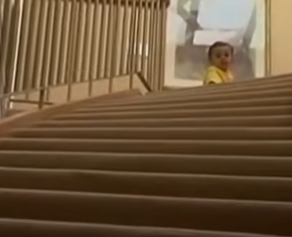
那我们不禁要问，婴儿是什么时候学会评估爬行时的风险的呢？
为了研究婴儿是什么时候学会评估爬行风险的问题，
科学家进行了一系列的实验。

## 视觉悬崖测试
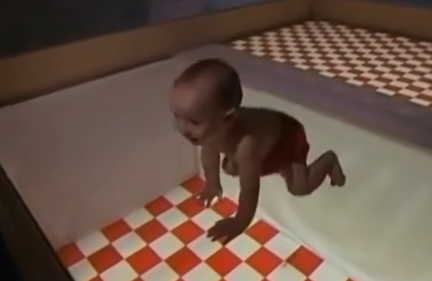
在视觉悬崖上，一半是很牢固的表面，另一半是看似会掉下去的透明表面。
把一个刚学会爬行的小宝宝放在上面的时候，虽然他可以看到深度，但是，
她仍兴奋地爬过深渊，因为她不了解深度的意义；

但把一个已经学会爬行数周的婴儿放在上面的时候，即使用玩具吸引她，
她都拒绝爬过悬崖，她表现出典型的恐高。

这两个小宝宝的唯一差别就是爬行经验的多寡。那么，科学家就得出结论：
当婴儿在刚学会爬行以及更早的时候，都是不会恐高的。

那么，爬行是如何使婴儿学会恐惧高度呢？
科学家就分析具备丰富爬行经验和不具备丰富爬行经验的宝宝，有什么差异呢？
* 猜想1：前者在爬行的过程中，摔了很多次之后，就建立了从看到悬崖就联想到
摔倒后的疼痛的映射，即，学会了评估爬行时候的风险。
* 猜想2：从视角的变化角度出发，在爬行过程中有一个非常重要的因素，就是
视角的变化，当宝宝爬行的时候，他观看到的视野中心的物体其实是变化不大的，
变化大的其实是宝宝眼角看到的内容（有大量的物体离开他的视线，并且有当量的物体
进入），科学家把动物这种观察远离凝视中心的视野的能力称为[周边视觉，或者叫
间接视觉，Peripheral vision](https://wikizhzh.top/wiki/Peripheral_vision) 。

很明显，猜想1是一个兜底的解释，猜想2是在更靠前的解释。
所以，我们就主要验证一下猜想2.
首先，科学家先做了一个活动房间实验，证明了爬行可以增强婴儿的周边视觉。

## 移动房间测试
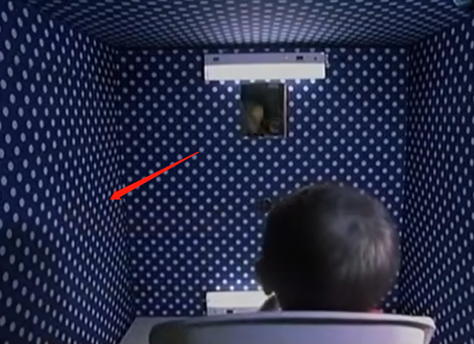
科学家把一个刚学会爬行的宝宝放在一个固定的椅子上，宝宝正对的墙是
可以前后移动的，科学家在窗口处用玩具吸引宝宝的注意力，并观察宝宝，
判断宝宝是否从眼角收集信息。当墙壁前后移动时，宝宝并没有什么特殊
反应。
当这个宝宝9个月大的时候，并且有了丰富的爬行经验，
再进行这个实验的时候，宝宝就会有很强烈的反应。
她害怕失去平衡，因此不断重新调整身体以维持稳定。

因此，科学家就得出结论：爬行经验，会让宝宝的周边视觉得到增强。

那么，怎么证明周边视觉能让宝宝对高度产生恐惧呢？为此，科学家又
设计了一个实验。

## 婴儿驾驶测试
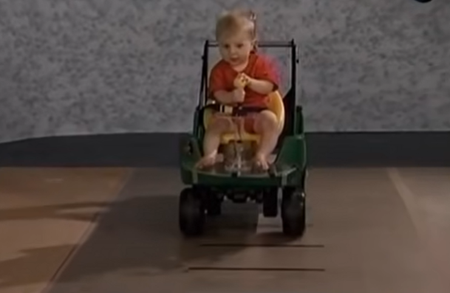
我们知道，不会爬行的宝宝不会恐高，如果能让不会爬行的宝宝增强
周边视觉，那么当这个宝宝刚学会爬行时，再进行视觉悬崖实验，就可以
得出周边视觉是否是让宝宝对高度产生恐惧的原因了。

科学家把不会爬行的宝宝放在了一个小车上，小车上有一个操纵杆，宝宝
可以通过操纵杆控制小车前进。宝宝坐上小车之后，很快就发现了操纵杆
和车子前进存在联系了，就不断的拉动操纵杆让小车前进。虽然宝宝面朝
前方，但他从周边视觉注意到他正经过墙壁，虽然他不会爬行，但是动作
控制能力给了他这样的信息。

几周后，当宝宝开始爬行的时候，科学家开始研究这种驾驶经验是否会让
宝宝恐高的时候，当首次把宝宝放在视觉悬崖上的时候，宝宝非常开心地
爬到了看起来非常牢固的一边，但当她妈妈在看起来很深的一边喊宝宝的
时候，即使宝宝刚学会爬行，却怎么也不愿意越过悬崖。

因此，科学家就得出结论：驾驶训练使宝宝增强了周边视觉，更加注意周边
视野，就可以得出周边视觉是让宝宝对高度产生恐惧的原因。

配图为2022年8月15日天津晚上7点的天空

待续...

## 巡行
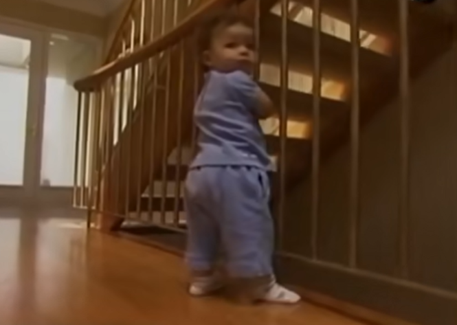
婴儿11个月左右，就开始利用所有能抓到的支撑，慢慢地横向走向目的地。
这个阶段的动作可以增强腿部肌肉和平衡感。
婴儿如何识别巡行时候的风险呢？

## 巡行的要件——双手
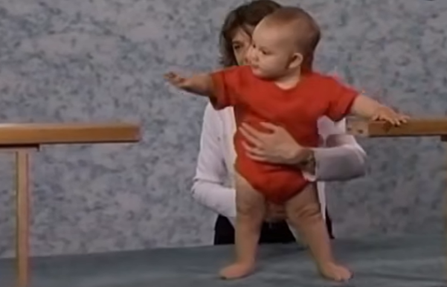
当缺口大到婴儿够不到的时候，就会恢复爬行。
所以，巡行的要件是双手。当婴儿巡行的时候，用眼睛盯着前方，利用双手
引导方向，从此判断自己能否安全移动。但移动的双脚却远离宝宝的视线。
那么，当婴儿脚下有危险的时候，婴儿会如何反应呢？

## 适应巡行的环境
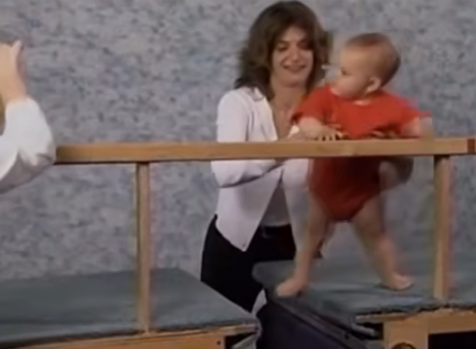
即使婴儿看到缺口，但是刚开始巡行时还是会掉下去。
婴儿在学习移动的每个阶段，都得重新适应新的环境。巡行也不例外。

## 走路
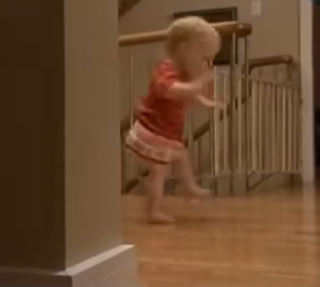
13个月大的婴儿一般就可以行走了，他们一般都会寻找一个启动平台。
刚开始他们张开双脚，小步行走，以保持平衡。他们步履蹒跚的前进，
因为他们无法协调动作，每跨出一步，都要重新平衡身体

## 走斜面
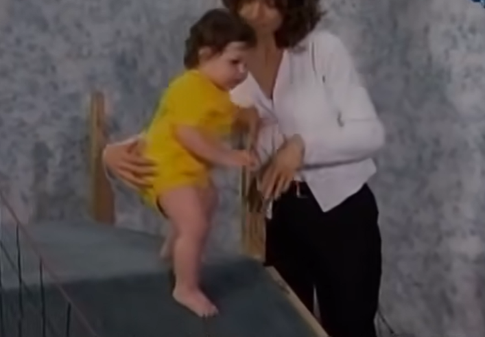
当婴儿14个月左右，走路就比较稳健了。
但是，婴儿走的路面会有很多崎岖不平的情况，他们必须学习如何适应。
他们的头脑必须识别出危险。
每一次尝试，都需要更多的动作控制能力。
婴儿会用脚轻踩地面，可以帮助他察觉到是否有风险

每当婴儿的移动方式产生改变，他们的世界也会剧烈改变，这代表
婴儿控制身体的方式完全改变，且需要大量练习。

## 明白走路的目的
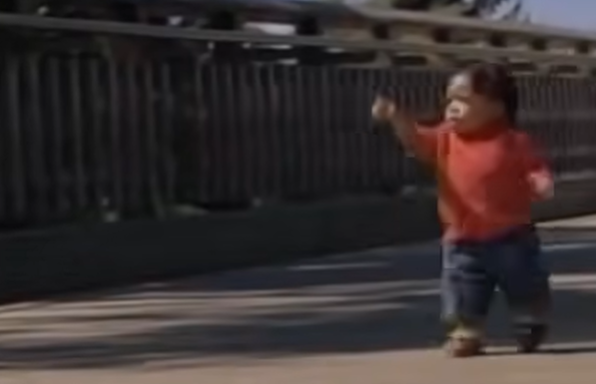
14个月左右的婴儿就知道了走路的目的是为了到达某处。
花的颜色、空气的味道、鸟的叫声都吸引着婴儿去探索和冒险。

# 认知思考

## 婴儿的视觉

2周大的宝宝生活在感觉的世界里，他会对一连串的刺激有反应。
但不知道其中的意义。宝宝的视力没有发展，所以刚开始宝宝更加
关注明暗信息，最让宝宝感兴趣的就是人类的脸庞。

因此就有科学家研究婴儿对脸孔的注意力，以及出生后前三个月是
如何发展的。

## 视觉的变化
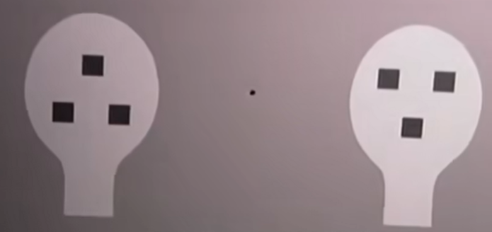
刚出生10天的宝宝会被右图吸引。
然后科学家，就想研究吸引她的究竟是什么。为了找到答案，又给
婴儿看了另一张图片
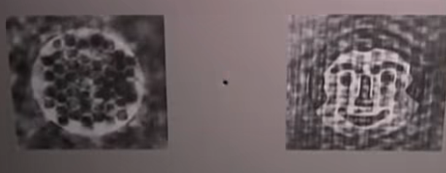
一边是模糊的脸孔，一边是只有明暗对比的脸孔.
婴儿喜欢看有对比的脸孔，这表示这个阶段的婴儿看到的不是五官，
而是五官的明暗变化。因此2周大的宝宝注意的是妈妈眼睛、嘴巴
和发髻的明暗对比，但不知道这代表什么。

6周的宝宝看到相同卡片的时候，他对比较像脸孔的图像感兴趣。
为什么会有这种不同的反应呢？
研究者认为这与接受视觉刺激的高等大脑中心有关，这会指引宝宝
注视东西，并开始为事物赋予意义。
同时，高等大脑中心的其他区域正准备让婴儿开始学会思考和推理。

## 发现事物之间的联系
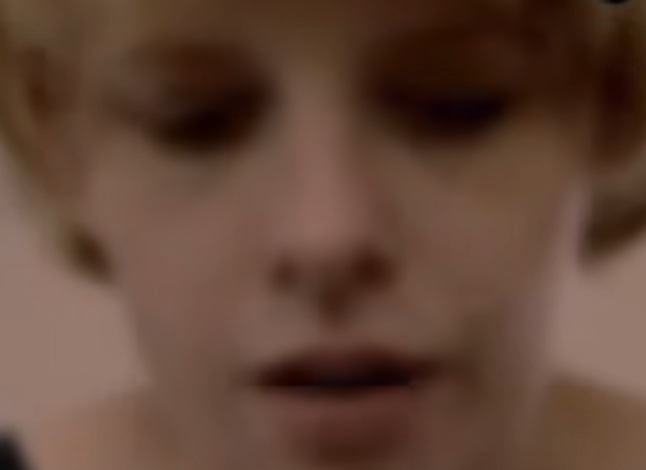
这是2个月大的宝宝看妈妈给他换尿布的场景，妈妈边换，边说话。
宝宝就会发现声音的来源可能与母亲开闭的嘴唇有关。
这是他首次将声音和影像结合起来。

## 分辨各种物体
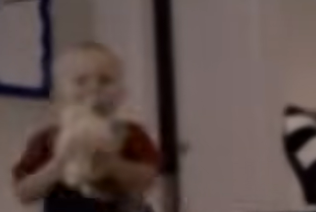
2个月大的宝宝观察屋里的场景，看到
有些东西（他的哥哥）似乎在移动，有些东西则静止不动。
会动的东西在静止的东西前面移动。

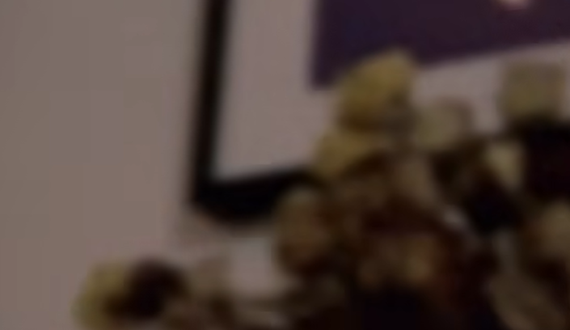
当宝宝浏览景物时发现，物体的边缘使他们与其他物体和背景区分开来。
这一点很重要，因为这可以让婴儿区分每个物体。
并让宝宝进入立体的世界。

## 视觉追踪物体

3个月大的宝宝可以分辨物体，更会追踪物体。

有时候，宝宝仿佛住在一个永恒的魔术世界中，事物总是无预警的突然
出现和消失。

那不仅要问，当物体消失在婴儿视线后，还会想起他们吗？

## 记住消失的物体
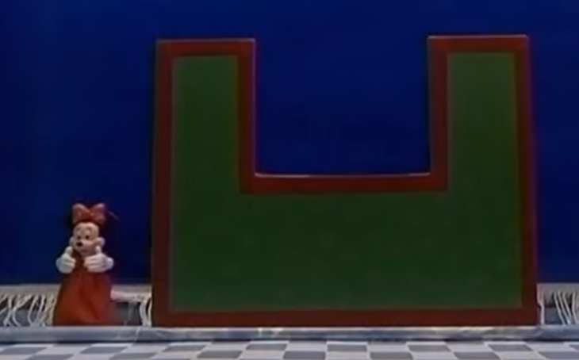
两个半月大的宝宝看着玩偶走到墙后，然后看到玩偶从墙的右边出来，
当玩偶从一边移动到另一边，他的眼睛也在移动，这表示，玩偶消失时
他仍想着玩偶。
重复一两次后，宝宝就变得厌烦了。他这个年龄，很容易对没有新鲜感的
事物失去兴趣。

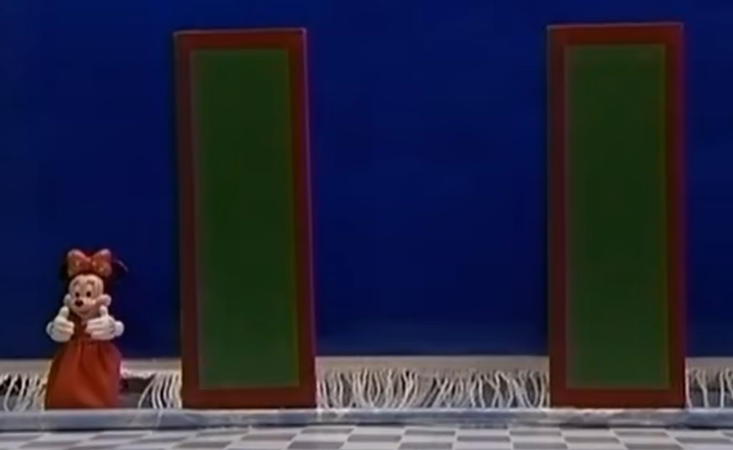
但后来布景变成了两个柱子，玩偶移动到第一个柱子后面，当玩偶从第二个
柱子后面出现的时候，宝宝就非常困惑，就像大人看魔术表演一样，
不可置信的看着玩具，仿佛知道，玩偶不可能凭空消失，从他瞪大
眼睛的时间长短来看，心理学家认为，他不仅知道物体在离开视线后
依然存在，也知道物体必须继续存在于时空中。

科学家继续这个实验，但是换了一个三个半月大的宝宝。
实验的布景也更换成了可以控制身高的小兔子。
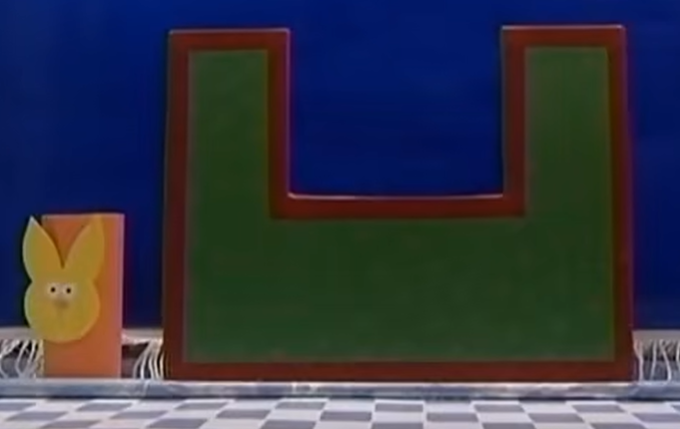
宝宝看到小兔子走到墙后面，并从另一端出现，他在第二次实验时，
已经开始追踪兔子，并期待他再度出现。几次重复后，宝宝觉得无聊了。

然后，科学家把兔子长高了
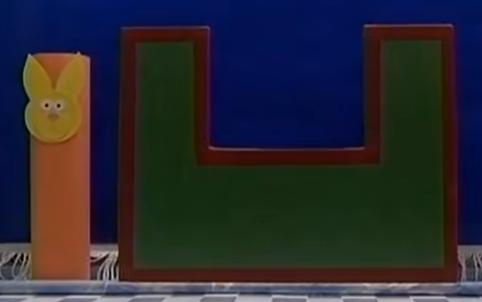
当兔子在中间消失一段时间后，又从第二个塔楼后面出现，宝宝就困惑
的瞪大双眼。
研究人员的结论是3个半月的宝宝知道的更多一些，高的物体不能躲在
矮的物体后面，令人惊讶的是宝宝通过观察进行思考，推理和解惑
并利用哲学家所说的逻辑法则

## 大脑保存物体的影像

宝宝的大脑可以保存物体的影像，即使它从视野里消失。这叫“物体恒存性”。

## 找出隐藏的物体

对一个6个月大的宝宝来说，找出藏起来的物体有几个步骤。
首先，玩具消失之后，要记住玩具的影像。
事先计划手要移动到哪里才能移开毯子，并启动拿东西的能力，
这是一个复杂的任务，同时毯子也可能成为新的玩具。
会让宝宝忘记他要找什么东西。

找出隐匿物体的能力在何时出现呢？
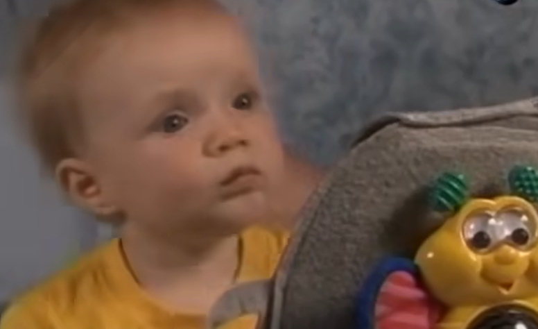
实验发现8个月大的宝宝，还是不行。而9个月的宝宝不仅可以发现，
还可以拿到。

## 隐藏的观念是如何发展的
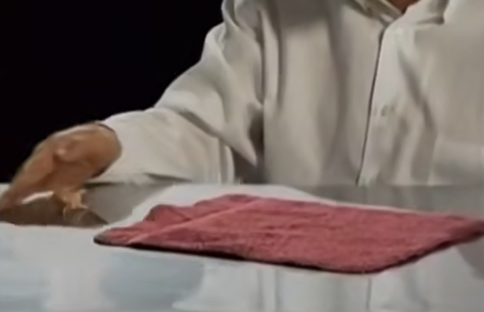
研究员对一个十八个月大的宝宝做实验。
当研究员用手盖住小猪后，宝宝知道翻开研究员的手，拿到小猪。
接着，研究员用手挡着小猪，然后把小猪藏在布下面，宝宝就不知道
小猪在哪里了。
也就是说，当隐藏的动作也被隐藏起来后，宝宝是识别不出来的。

## 记住物体的性质
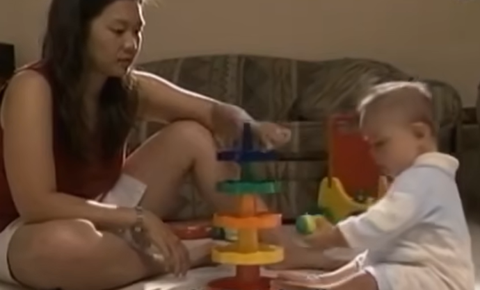
当婴儿已经发现物体从眼前消失后依然存在后，他们也知道这些
物体的特性，比如尺寸和形状。

科学家就想研究，婴儿是从多大开始发现这些事情的。

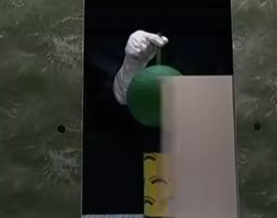
科学家就设计了一个实验，一个大球，一个细圆筒，一个挡板，
对一个5个月大的宝宝测试。
当挡板拉上之后，科学家把营造出大球藏进了细圆筒的假象，然后
宝宝非常吃惊。

然后换成一个粗圆筒的时候，宝宝看着就会非常无聊。
同样，科学家也做了高度的测试。

科学家得出结论，婴儿在了解物质世界之后，会区分，上面、下面、
外面、里面等类型。

那么，宝宝学习物理法则的时候，是否可以一次学习多个物理法则？

答案是否定的，科学家做了以下实验。

## 不能同时学会多个物理法则的组合
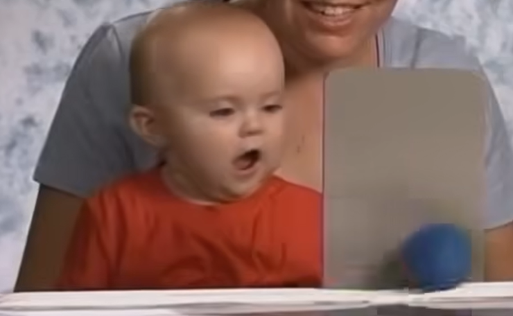
科学家对9个月的宝宝进行测试，一个球在一个斜坡上滑动，斜坡上
有一个挡板，宝宝的眼睛会一直追着球。这表示宝宝知道物体永存的法则。

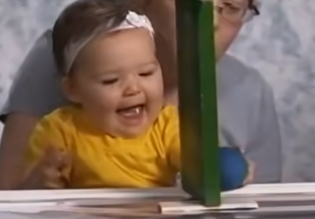
上图是墙壁挡住了滚动的球，宝宝知道球被挡住了，这是因为宝宝知道
另一个物理法则——固体无法穿越另一个固体。

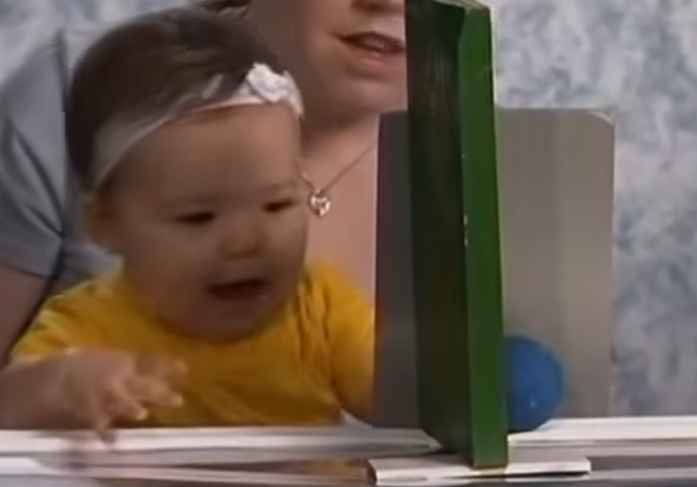
上图是墙壁和挡板都上了，然后宝宝还是会在后面等着用手接球。
当然，宝宝是接不到的，而且她也不知道球去哪里了。
因为，她根据对挡板的了解，知道球只是暂时离开的他的视线，但是，宝宝
不能再组合上 固体不能穿越固体的 法则了。

9个月的他 不能将这两个法则结合起来。

但这并不表示，宝宝无法整合物理法则。

## 数学能力何时产生
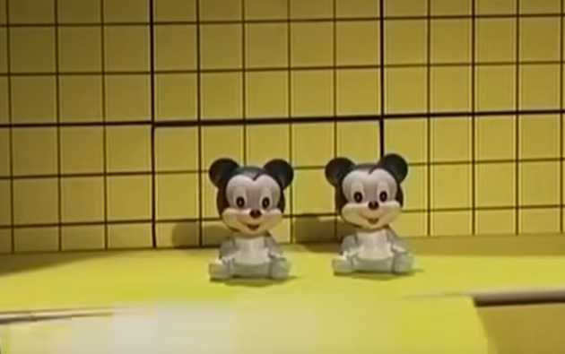
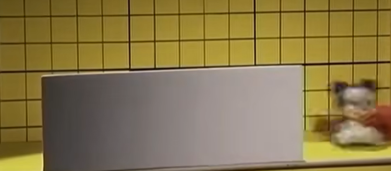

科学家对6个月大的宝宝做加减法实验。
实验开始，在舞台中央有1个玩具，然后盖上挡板，实验人员让宝宝
看着，自己往里面又加了一个玩具，然后打开挡板，展示出两个玩具，
此时宝宝没什么反应。

如果出现不可能的结果，婴儿会怎么反应呢？
科学家继续实验，当加入第二个玩具之后，从背景板掏走一个玩具，
打开挡板后，宝宝只看到一个玩具，就表现得非常吃惊，好像知道
这不是正确答案。

然后，又测试了减法，很快就发现宝宝对不可能事件非常好奇。
因此，科学家得出结论，6个月大的宝宝可能就具备了基本的数字概念。

除了加减法，人类的数字观念与感知能力有关。
这使人类能掌握多寡的概念。

那么婴儿何时能超越感知能力，用数字思考呢？
是从宝宝会数数开始吗？

## 用数学思考
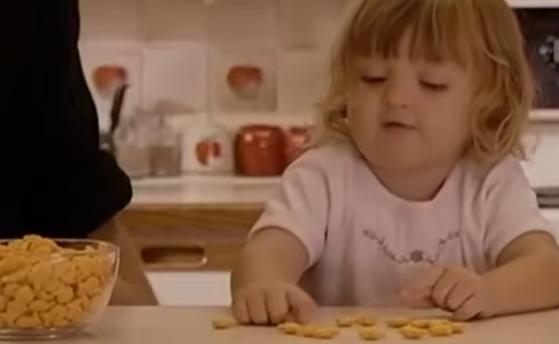
科学家对他2岁半的孩子实验。
虽然宝宝可以从1数到10了，但只是机械的数。
当爸爸找宝宝要3个饼干的时候，宝宝也不知道应该给多少个。
她需要再过几年，才能知道数数的意义。

数字和算数是人类整理对周边世界看法的一种方式。
分门别类是另一种方式

物体可依照形状、颜色、大小加以分类，这个是逻辑推理的基础。
也是宝宝认识到这个世界潜在的某种秩序。

婴儿知道这个世界充满各种形状和大小的物体，而且这些物体遵循
某些法则，于是他们开始用这些物体做实验，他们发现某些物体
能让他们完成原本无法完成的任务，并逐渐进入新的发展阶段——使用工具

婴儿要到几岁才能使用工具呢？

## 使用工具
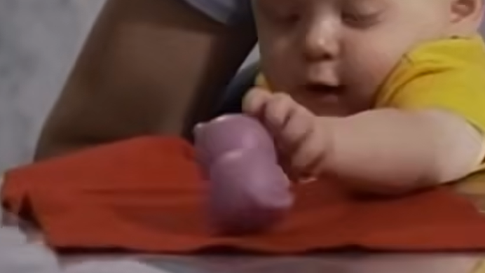
实验：一个玩具放在一块布上，宝宝拉动布，就可以够到玩具。
测试发现，8个月的小宝宝不会利用布，而11个月的宝宝会。

然后，科学家给8个月的宝宝示范了一下拉布，然后宝宝立刻就学会了。
婴儿就是这样学习的，和科学家一样，观察是关键所在。

## 使用劣势手
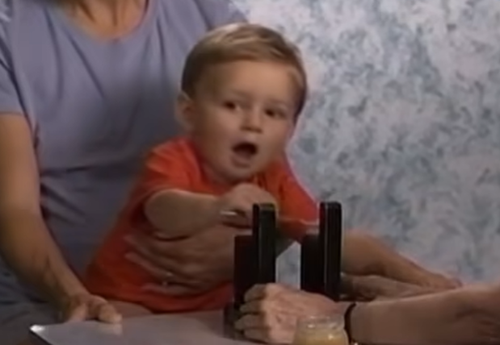
实验：科学家把勺子里放一点果酱，然后让宝宝来取勺子，吃果酱。
不过放置勺子是有方向区别的，当勺子柄在宝宝优势手一边时，宝宝
取勺子时非常容易。
然而当反方向放置时，即便是14个月大的宝宝，仍使用优势手，即使很不方便
吃到食物；
但是18个月大的宝宝，就会利用对工具的了解，与他的思考技巧解决问题，
他就会放弃使用优势手，而使用劣势手拿起勺子。

## 使用更复杂的工具
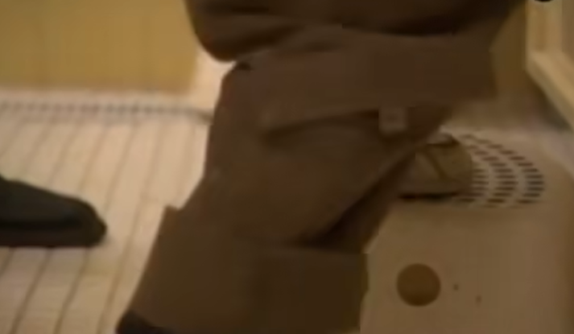
18个月大的宝宝就可以掌握使用一些较为复杂的工具，来解决日常所需了。
比如小塑料凳、牙刷等

## 知道何时需要使用工具
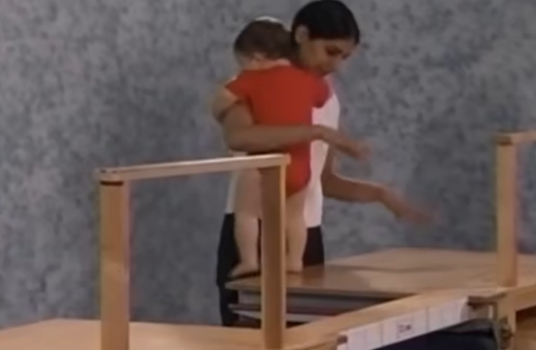
14个月大的宝宝，不敢走过没有扶手的缺口

## 确认工具的可靠性
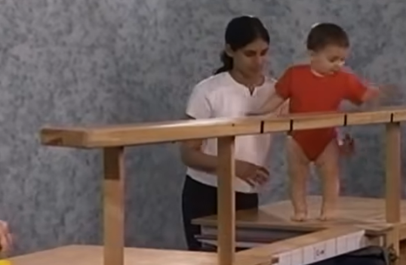
当给缺口装上扶手之后，宝宝会拍打几下扶手，看看是否可靠。

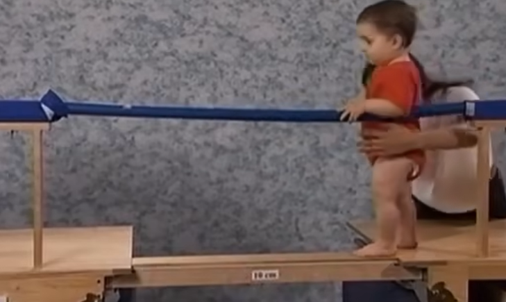
当把扶手换成软质橡皮扶手之后，宝宝摸了几下，也放弃走过去。

## 了解他人
宝宝知道自己想要什么，但别人想要什么？他们有什么企图？
婴儿如何得知其他人的想法呢？

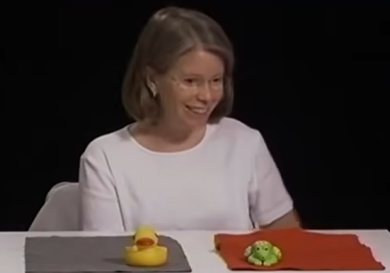
研究员对一个11个月大的宝宝做实验，研究员把手放在青蛙上面，
来告诉宝宝自己想要青蛙，然后反复做几次，宝宝就不感兴趣了，
然后研究员就不放在青蛙上面了，而是放在青蛙的布上面，然后，
宝宝还是没有感兴趣，因为宝宝知道这还是她想要青蛙的意思。
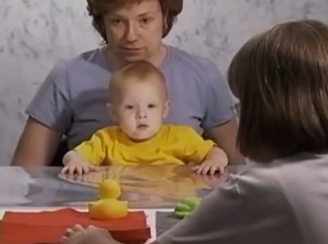
但是当研究员把手放在小鸭子的布上面，宝宝就突然感兴趣了，
宝宝知道她现在想要新玩具了。

这就显示出11个月的宝宝，就已经懂得从他人的行动判断其意图了。

## 了解自己和别人是不同的
宝宝起初是认为别人的想法、品味、意见和自己是相同的。
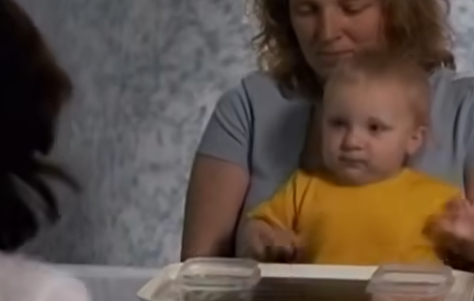
研究员让一个14个月大的宝宝从两种零食中做选择，当研究员确认
宝宝喜欢某一个零食之后，把托盘拉倒自己面前，故意选宝宝不太喜欢
的零食吃，然后做出好吃的表情，然后再选宝宝喜欢吃的零食吃，并
表现出不喜欢的表情。
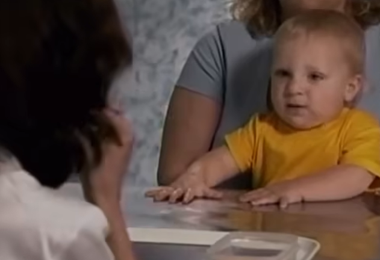
然后研究员把托盘推到宝宝面前，然后向宝宝索要零食，结果宝宝还是
会把自己喜欢的零食给研究员。

接着，又换了一个18个月的宝宝，结果这个宝宝就会选择研究员喜欢的
零食送给研究员了。

这就表明这个18个月大的宝宝已经学会了解他人。

拍摄于2022年8月16日早晨上班路上

待续...

# 牙牙学语
## 听到声音

当胎儿24周时，胎儿的内耳已经发育，并能听到声音。可以听到母亲的心跳
以及外界的声音。在之后的时间里，胎儿会逐渐熟悉父母的声音。
研究表明，父母说话的声调和节奏会让胎儿心跳加速，这是胎儿与外界
沟通的开端。

## 哭

婴儿一出生还无法发出其他声音，因为他们嘴巴小，舌头大，
舌头还在喉咙上面，哭泣可以帮助婴儿避免窒息。

## 用哭沟通
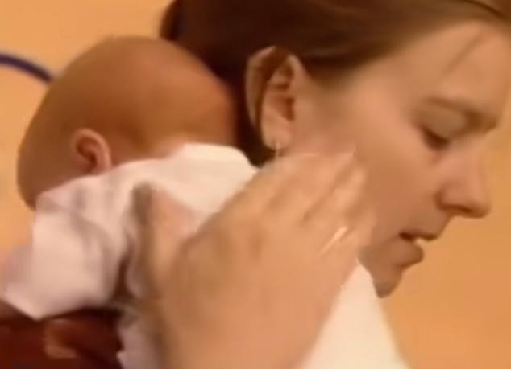
虽然婴儿会不自主的哭泣，但他的母亲会给予回应。那么，
宝宝就由此得知，自己发出声音可以进行沟通。
当宝宝听到妈妈的声音后，就立即平静下来了。

## 新生儿的语言偏好
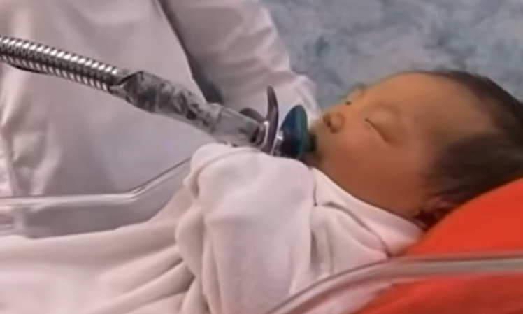
研究员想研究刚出生的新生儿是否携带有语言偏好。
研究员把连接电脑的奶嘴放入刚出生12小时的新生儿口中，
电脑的另一端可以采集新生儿吸奶嘴的频率和力度。
然后，用音箱播放菲律宾语 和 英语（母语）。实际的字被
去掉了，因此以节奏分辨两种语言。

结果显示，当播放菲律宾语的时候，婴儿没什么反应，但是，播放
英语的时候，婴儿的吸奶嘴的频率和力度明显提升了。

这透露了两个事实。婴儿在子宫里的时候就开始学习语言的特性。
而且出生后，偏好母语的节奏胜过他们不熟悉的语言。

## 倾听和吸收
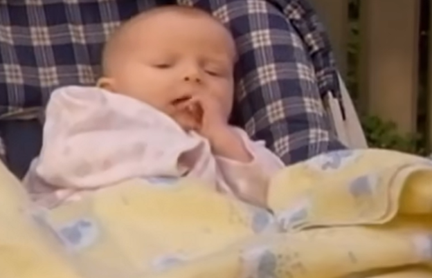
听妈妈说话，听勺子敲打杯子的声音
能区分人咳嗽的声音和鸟叫声

婴儿一出生就能分辨说话的声音，这是一种不同于其他动物的独特沟通能力。

## 分辨实词和虚词
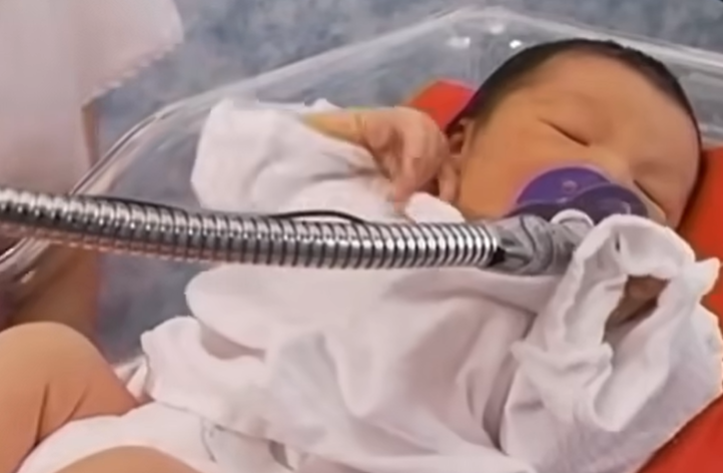
还是做之前的实验，对一个出生不到24小时的宝宝说虚词和实词，
观察宝宝的反应。

结果显示，当说一些没有意义的 in、the、it时宝宝没有反应；
当说一些动词和名词 toy chair find 时婴儿的吸奶嘴的频率
和力度明显提升了。

这说明刚出生的婴儿能分辨实词和虚词。

人类不仅仅以声音进行沟通，同时还会察觉到说话人的面部表情。

## 了解脸部表情
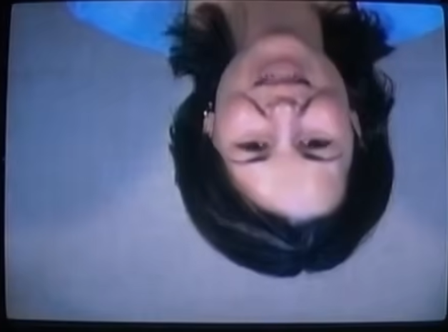
当妈妈对一个6个月大的宝宝倒着说话时，宝宝会坐立不安，因为
宝宝认为这样无法和妈妈进行沟通。

使用悲伤的表情配上快乐的声音，也会察觉到这样的沟通存在问题，
会让宝宝很不适应。

当妈妈不看着宝宝说话的时候，宝宝也会哭闹。

因此，研究员认为，即使小到眼神接触的脸部表情，也在宝宝的沟通中
扮演着重要角色。

## 消除环境中没听过的声音
宝宝的脑部会筛选属于自己语言的声音，消除环境中没听过的声音。

## 学习第二语言
宝宝如果从小只学习母语的话，就会过滤掉其他语言的声音。
但是，如果学习双语，那么，宝宝就可以掌握两种声音。
宝宝刚出生的时候，学习语言的能力是非常强的，能够分辨发声中非常细微的不同， 
但是过了一定的时间，再学习某一种语言的时候，就会难得多。

## 嘴巴声音映射
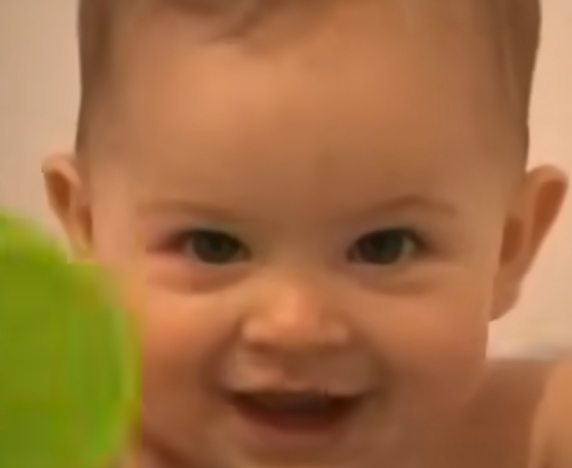
宝宝在发声的时候，也会听自己在说什么。
假如他经过多次尝试，发出了一句和妈妈的声音很像的声音，自己会非常开心。
模仿和重复是学习语言的关键。

## 用姿势沟通
在宝宝学会发声和语言之前，是会用姿势进行沟通的。
姿势可以传达感觉，意图和渴望。比如跺脚，用手指向某个东西。

## 指东西
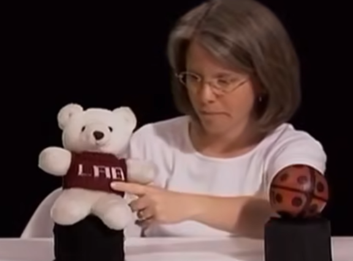
婴儿能了解指东西的人和那个东西之间的联系吗？
实验对象是一个8个月的宝宝。研究员反复指向小熊，直到宝宝厌烦。
然后指向小球，宝宝就会感兴趣了。

因此，说明宝宝的注意力显示，他知道重要的不是手，而是手指指向
的东西。

人类看到指着东西的手指，就会知道会看到有趣的事物。

## 手指和眼神搭配对婴儿的学习非常重要
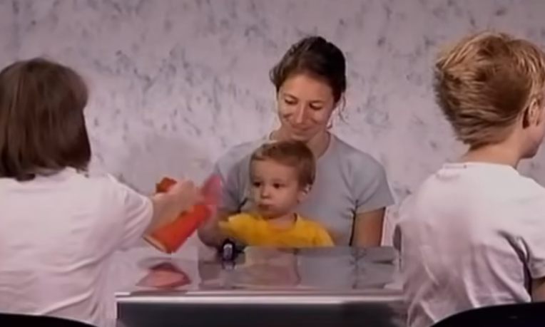
实验对象是13个月的宝宝。
当研究员指着一个物体并看着这个物体发声的时候，宝宝可以记住
这个物体的名称。
但是，当一个研究员发声，另一个研究员指着物体的时候，宝宝就
不知道这个物体的名称了。

结果表明，婴儿必须同时看到说话者的手指和眼神，才能学习新字。

## 手语比说话更容易
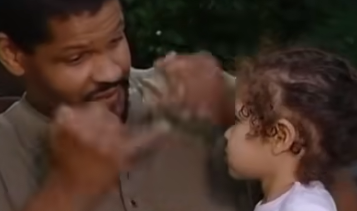
因为控制手比协调舌头，嘴唇和下巴容易。事实上，控制身体动作的
脑部中心比语言中心发育的早。

这也解释了模仿在学习语言中扮演了重要的角色。

## 懂得轮流的概念
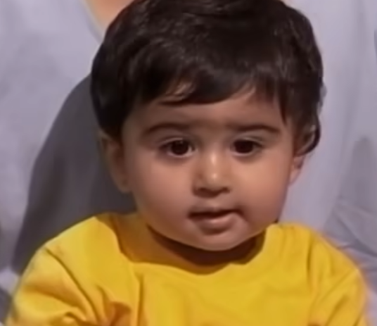
宝宝和别人沟通的时候，无论是说话还是模仿，是懂得轮流的，
这是一种潜在的沟通结构。

## 讲完单词

1岁后的宝宝从发声，开始学会讲完整个单词。

在前18个月，宝宝会使用50~100个常用字。
但他们能听懂的字要更多。
他们最先学会的单字中，7成是名词。他们从日常生活中学会
各种事物的名称。食物和身体部位是最先学会的。

## 回应问题和遵循简单指示
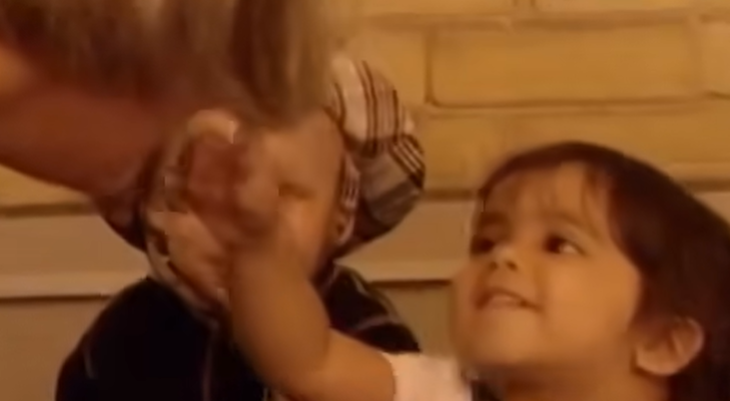

## 使用文字
1岁半的宝宝会突然学会使用文字

## 形状对学习事物的名称很重要
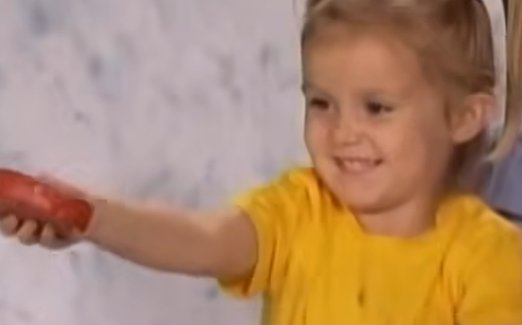
2岁的宝宝会根据形状记住物体，而非其他特征。

## 说小句子
发音仍有待加强

等宝宝到了2岁，会使用300个字，并了解1k个字。

# 情感的萌发
## 主动微笑
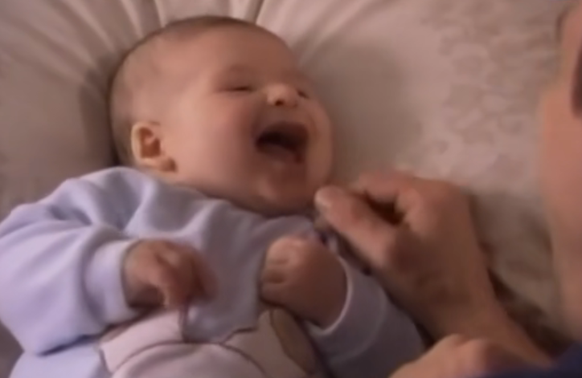
1个月大的宝宝就可以在与爸爸的游戏中，主动微笑了。
婴儿和早期的家人的亲密互动，是赋予它微笑能力的关键。
少了与家人的互动，幼儿的微笑能力会严重迟缓。

## 交际性微笑
3个月的宝宝可以发出交际性的微笑，来邀请他们来玩耍，
这也是社交能力的觉醒。

## 婴儿能表达的情感种类
3个月大的宝宝就可以传递 惊讶、喜悦、挫折与愤怒等基本（原始）情绪。
随着婴儿成长，其表达会更加细微。

## 联结声音与表情

这个实验是两个屏幕播放快乐和悲伤的画面，然后中间有一个喇叭，
会随机播放快乐的声音和悲伤的声音，然后让婴儿匹配。

实验表明：
宝宝在大概12周的时候，就可以把妈妈的声音和妈妈的表情联系在一起。
大概14周，处理陌生女性。到18周，可以处理爸爸的。

## 情绪是婴儿的第一语言
在婴儿会说话之前，情绪是婴儿的第一语言。但这些情绪的强烈程度，
要视婴儿的性格而定。每个婴儿都有各自的天生性情。

## 婴儿反应强烈与否与其性情有关
不同婴儿面对外界不同程度刺激的时候，反应是不同的。有的孩子喜欢
大的刺激，有的孩子则接受不了太大的刺激

## 读懂别人的表情

这个实验是视觉悬崖的实验。实验对象是10个月的宝宝。
研究员把宝宝放在看起来牢固的一边，然后让妈妈站在看起来危险的一边。
当宝宝爬到视觉悬崖中间时，犹豫能不能爬过去的时候，
当看到妈妈做出严肃的表情的时候，宝宝是不会爬过去的；当看到妈妈
微笑的表情的时候，是会爬过去的。
这说明宝宝是可以从妈妈的表情上得到引导的。

## 性格的改变
虽然婴儿生来就带着自己独特的性格，他们对外界的反应并非终生不变。
周边的人对他们性情的反应，会影响宝宝的反应，并帮助其发展。

## 自我调节情绪
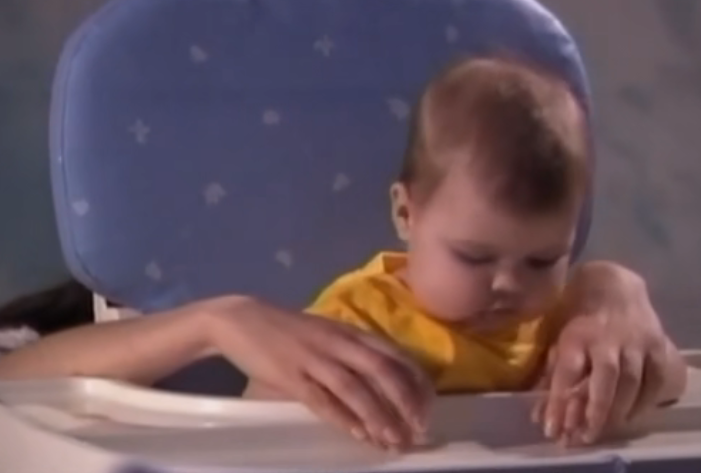
当宝宝的双手被束缚了，可以通过看电视来转移宝宝的注意力。
有的宝宝也会啃咬研究员的手臂来调节自己的愤怒情绪。
婴儿的情绪可能由有吸引力的外在事物 或 自己的不同应对方式调节

## 独自面对恐惧的对策
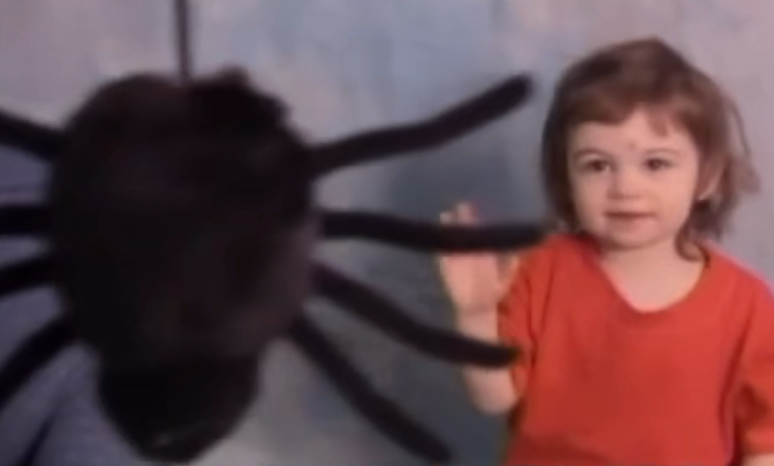
这个2岁的宝宝面对可怕的蜘蛛的时候，会选择唱歌来对付恐惧。
经更多研究发现，婴儿在满周岁之前就具有独自面对恐惧的能力。

## 独自面对挫折的对策
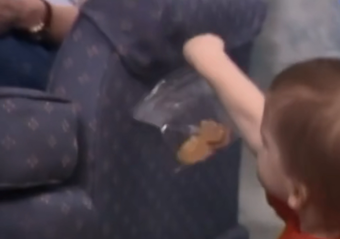
18个月大的宝宝，想让妈妈打开密封袋拿出饼干，如果在寻求大人的
帮助之后，没有得到帮助，会以各种各样的方式表达挫折感，有的哭、
有的气愤、还有的慢慢梳理问题出在哪里再让妈妈帮助。
研究员要观察婴儿能坚持多久，以及会有哪些方式来减少挫折感。
结果有的会继续大哭，有的会生气解开爸爸的鞋带，还有的会坚持直到打开。

## 习得更多感受
在宝宝成长的过程中，会逐渐体验到更多不同的感受。
惊讶、愤怒、喜悦和恐惧等原始情感逐渐产生各种微妙变化。

## 自我意识情绪
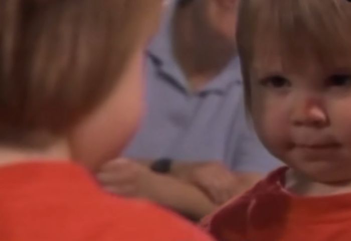
2岁的宝宝的鼻子上被涂了口红，然后把她放在镜子前，然后她会说自己的鼻子
上面有脏东西。 但是更小的宝宝较难有这种意识。

研究表明，宝宝在将近18个月时，会进入具有自我意识阶段。

## 自我意识情感——困惑（puzzled）
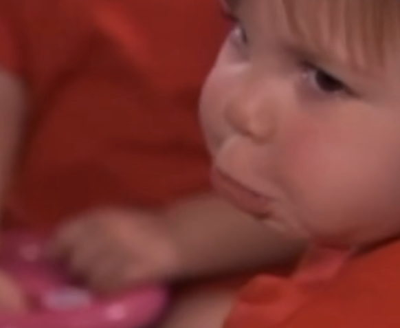
当研究员不停地指着宝宝，喊他名字的时候，发现有的宝宝就会
产生困惑感，有的宝宝就不会。

研究员推断唯有认识自己的婴儿才会产生困惑感。
同时，困惑感的表达也各不相同，这与婴儿的性格有关系。
有时候困惑感会强烈到让婴儿无法面对。

## 自我意识情感——自豪和羞愧
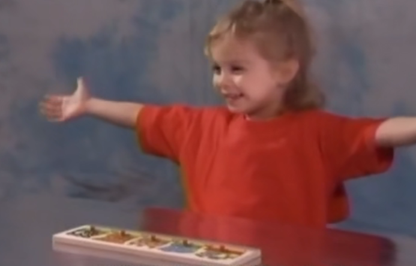
研究对象是3岁的宝宝。
研究员要求宝宝在三分钟内把拼图拼好。但是，研究员可以偷偷控制计时器，
第一次研究员等待宝宝拼好，然后控制计时结束，然后宝宝就非常自豪。

第二次，研究员当然就是提前响铃，宝宝就表现出了羞愧感

当然婴儿表达羞愧的方式也不同。
有的会表现出困惑，有的会拒绝失败。

虽然表达自豪的方式也很多，但是基本都不会被认错。

研究员推断，唯有在意自己的成就与失败时，孩子才会显露出自豪与羞愧。

# -----

## 婴儿如何认识高度和深度

# 新生儿的认识和知道
我们知道，新生儿从离开母亲来到世界的那一刻，是什么都不认识的，什么也不知道
的。不知道妈妈是什么，不知道小推车是什么，甚至不知道自己是什么。
其实，这里有两个关键词，一个是“认识”，一个是“知道”。“认识”主要是强调对
某个物体的固有属性的了解，比如说，站在我面前的是一个人。人可以有头、脖子
等身体部位组成，人有自己的身高、体重等。如果达到了认识的水平，那婴儿就可以
区分产房里哪个是人，哪个是小推车等之类的物品。而“知道”就要比“认识”高
一个层次，“知道”主要强调在认识的基础上，还知道某物体具备哪些功能或
情绪之类的东西。以区分妈妈和护士来说，不仅要认识屋里有两个人，还要知道
哪个人是妈妈，哪个人是护士，只有区分开，未来婴儿才会知道谁能给自己喂母乳。

当然，这里用的 认识 和 知道 其实在汉语语境下很多时候都可以混用。所以，
我还是在精简一下我想表达的意思，“认识”侧重强调定位并识别出抽象物体；
而“知道”侧重强调对识别出的抽象物体进行差异化识别，然后脑海里可以赋予该
物体具备的独特特性。

其实对应当前CV的技术就是人物检测+人脸识别。等于是把两个紧密结合的任务
完全的分开做了。

那么，新生儿是先学会认识的，还是先学会知道的呢？用力思考一下自己当时是
如何做的，不过应该是记不起来的了，我也不相信世界上有人会记得自己
刚出生时候做的那些事情，其实这一点也挺有趣的。不禁就要问，为什么人从
出生到死亡一直在接受和处理外界的信息，为什么长大一点接受和处理过的信息
就都保存在脑海中了，而更小时候的信息就都丢失了呢？那么我们有记忆的
时间节点又是什么时候呢？

# 记忆的流失
我用力回想我的童年最早的还有记忆的事情是，我5岁的时候，那个场景是我去
小伙伴家里玩，然后打闹追逐，跨过她家门槛的时候我大喊了一句，我5岁，
然后她大喊了一句，我4岁。那可以说这个时间节点是5岁的时候吗？显然
不对。因为，在我5岁的时候，都能跑能跳了，每天也知道去找谁一起玩了，
说明当时是肯定有记忆的了，已经能很好的处理外界的信息了。只不过，
20几年过去了，更多的记忆已经丢失了。这一点也挺奇妙的，人脑不像计算机，
计算机记录之后的数据就不会丢失了，而人脑记录之后的数据是会丢失的。
其实，人脑丢失的哪些数据都是一些稀疏平常的记忆。还是以我为例，我可能
除了跨门槛喊5岁的场景还记着，之前的记忆可能就被大脑抽象存储了，可能
就存储了一点点最有价值的信息，比如，这个小伙伴人挺好的，没和我打过架，
以后还能找她玩之类的。其实换个角度来说，假设某人的记忆不会丢失，那么，
他的脑袋存储的东西就会越来越多，就像一台摄像机一样，把一天天发生的事情
都录成视频，我们不禁就会问，他的脑袋存的下这么多东西吗？接着就会问，
即便存的下，当他回忆往事的时候，会不会检索速度极其的慢，导致他大脑冒烟？
如果检索速度降下来了，那他的即时反应能力也会大大降低，比如当一辆车失控，
向他撞过来的时候，他还要去思考好久，那小命都没了。

所以，我们也常说，一个人如果心里装的事情越多，那么他就很难集中精力做一些
事情，活的也很累。这么想下来，是不是我们还要感谢大脑的遗忘机制，这是对
我们身体的保护。当然，这里的遗忘肯定不是从记忆中完全的删除，而是以一种
更加“廉价”的存储方式保存了下来，比如，总结出了一个经验，或者总结出某个人
人品很差，要远离他等等。

# 人类的感官
这里一定要提的就是环境交互。生物学上说，一个生物的性状是由两方面影响的，
一方面是基因，另一方面是环境。只要是人的话，基因组其实都差不多，对婴儿
产生影响的主要还是环境，就像“狼孩儿”的例子一样。人体的基本感觉有视觉、
听觉、嗅觉、味觉、触觉，还有一种机体觉（人对内脏器官的感觉，比如饥饿口渴等）
人在做一个动作时，往往都要涉及到多种感官，比如人饿了想吃好吃的，感觉到
饿，其实就是机体觉，吃好吃的其实就是味觉。而计算机是缺乏很多感官的，所以
要完全从婴儿的认识过程出发，肯定会有很多问题。

# 新生儿启动呼吸系统
无论如何，我们还是先分析吧。
新生儿是如何和环境进行交互的呢？新生儿刚出生，就开始哭，这个时候的哭
主要是启动呼吸系统，放声大哭可以最大程度的增强呼吸作用，等呼吸系统稳定之后
婴儿就会停止哭泣。

# 新生儿是如何认识物体的

